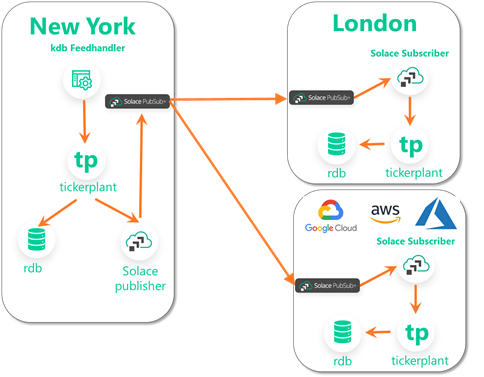

# kdb+tick+solace

Forked from https://github.com/KxSystems/kdb-tick

### kdb+ Solace Integration Repo

Code in this repo shows various patterns that can be accomplished using KDB and Solace.

Use the [official installation guide](https://github.com/KxSystems/solace#installation) to install the kdb integration with solace

### Setup instructions

 * Copy q/solace.q to your Q_HOME directory.
  
 * Setup Solace PubSub+ using [this link](https://solace.com/try-it-now/)

### Examples

    * tick/solace-tp.q - shows how to feed your ticker plant with data coming from solace.     
  

    * tick/tp-solace.q - show how to publish out ticker plant updates into solace. 

Be sure to modify the solace connection details in the files above to match your Solace installation credentials:

```
default.host :"localhost:55555"
default.vpn  :"default"
default.user :"default"
default.pass :"default"
```

You can now wire both of these two examples together to enable realtime kdb+->kdb+ replication architecture across distributed q aplication.





